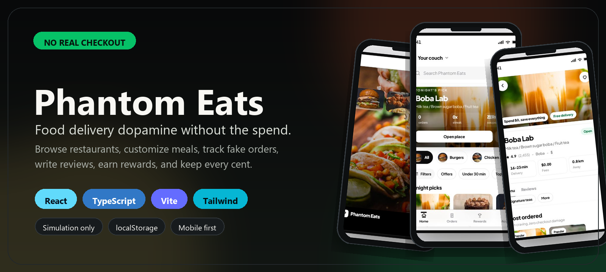
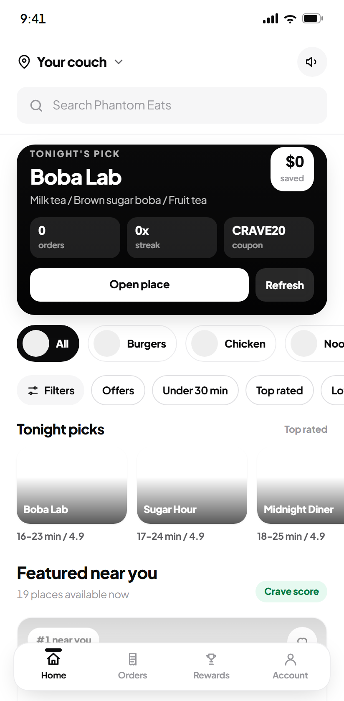
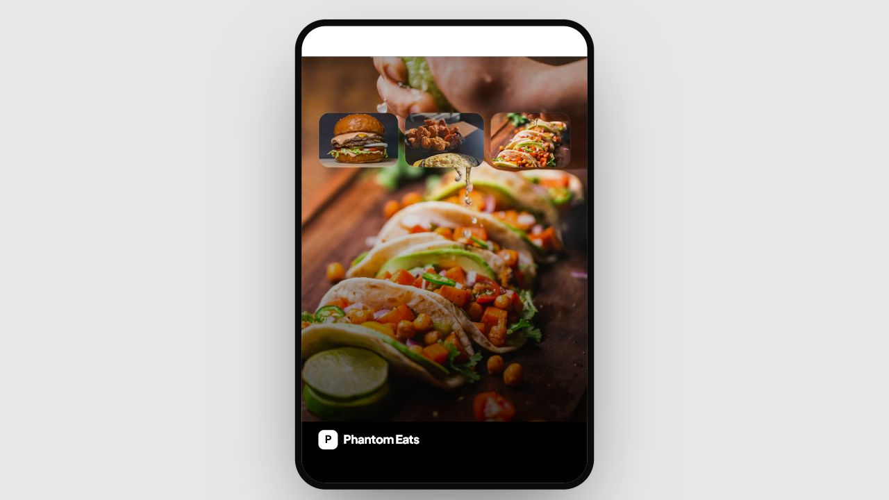
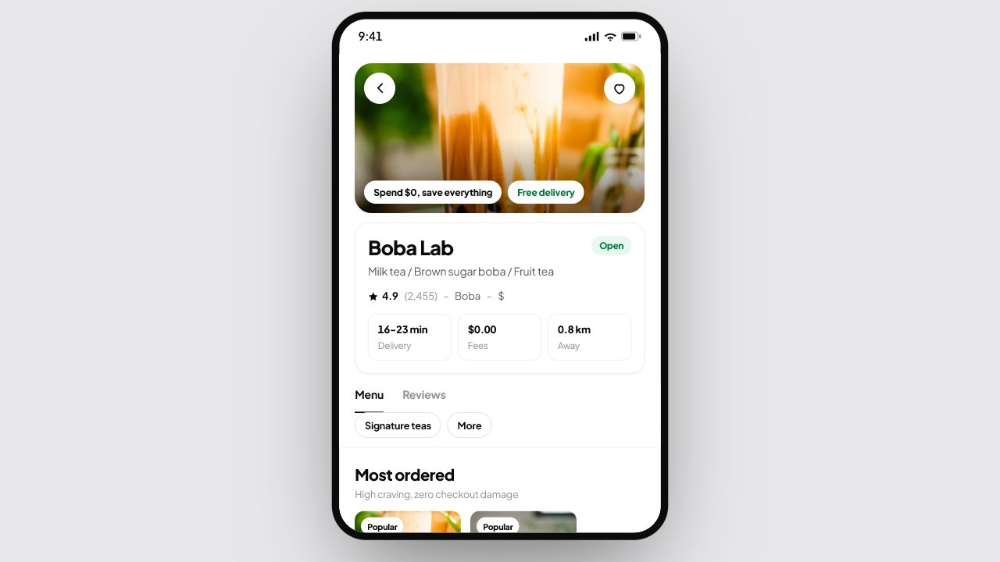
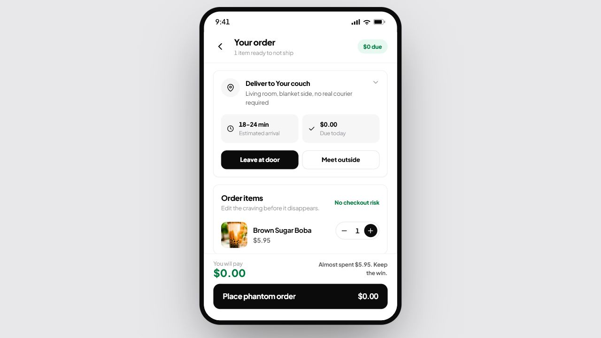
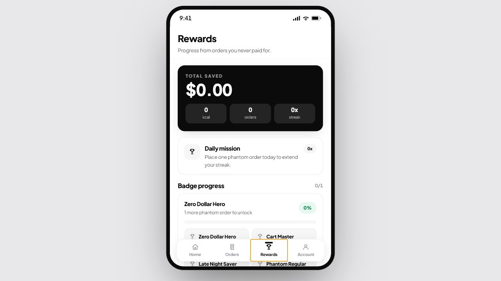
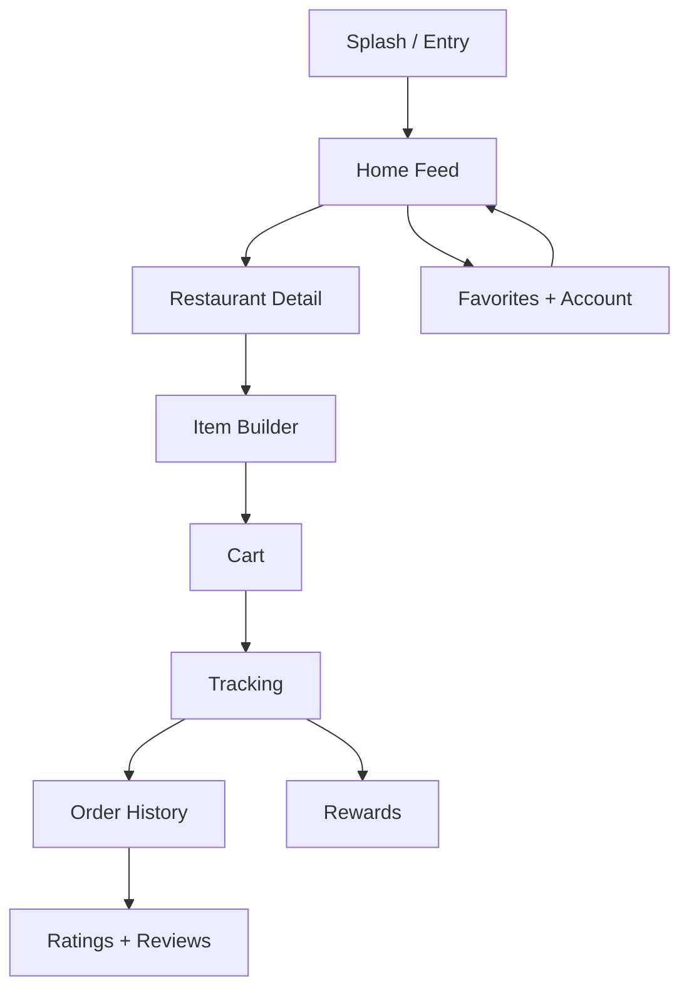

<div align="center">
  

  <br />

  <strong>A dopamine-first food delivery simulation built to feel real, cost nothing, and reward restraint.</strong>

  <br />
  <br />

  
  
  
  

  <br />

  
  
  

  <br />
  <br />

  <a href="#overview">Overview</a> |
  <a href="#screenshots">Screenshots</a> |
  <a href="#features">Features</a> |
  <a href="#tech-stack">Tech Stack</a> |
  <a href="#architecture">Architecture</a> |
  <a href="#installation">Installation</a> |
  <a href="#roadmap">Roadmap</a>
</div>

---

## Overview

Phantom Eats is a polished food delivery experience where the checkout ritual is the product. Users browse restaurants, customize meals, place a simulated order, track a courier-style delivery, review the experience, and collect rewards while spending **$0.00**.

The interface borrows familiar delivery-app patterns, then flips the outcome: the craving gets satisfied through interaction, the payment stays fake, and the reward system celebrates not spending.

> **Simulation only:** Phantom Eats does not place real orders, process payments, create accounts, or connect to restaurants.

---

## Screenshots

<div align="center">
  
</div>

| Splash | Restaurant |
| --- | --- |
|  |  |

| Cart | Rewards |
| --- | --- |
|  |  |

---

## Features

| Area | What it does |
| --- | --- |
| Marketplace Home | Photo-led restaurant feed with search, cuisine filters, top picks, promo surfaces, and quick cart access. |
| Restaurant Detail | Hero imagery, sticky menu tabs, reviews, most-ordered highlights, and menu sections designed for scanning. |
| Item Builder | Required and optional modifiers, notes, quantity controls, and a cart CTA with lightweight feedback. |
| Cart Simulation | Delivery choices, fake promo theater, savings summary, and a zero-dollar checkout moment. |
| Order Tracking | Courier-style status timeline, ETA states, map motion, and a reveal when the fake order completes. |
| Order Reviews | Order history with reorder actions, star ratings, and written review capture. |
| Rewards Loop | Saved money, avoided calories, streaks, badges, fake coupons, and progress moments. |
| Persistence | Favorites, cart-adjacent progress, orders, savings, and settings remain in localStorage. |

---

## Tech Stack

| Layer | Technology |
| --- | --- |
| App Framework |  |
| Language |  |
| Build Tool |  |
| Styling |  |
| State Persistence | `localStorage` hooks for orders, favorites, savings, cart, and settings |
| Media | Unsplash photo ids rendered through a local image URL helper |
| Feedback | Web Audio and Vibration API for small interaction rewards |

---

## Architecture



---

## Project Structure

```text
src/
  App.tsx                 screen state machine and app shell
  data.ts                 restaurants, menus, reviews, and photo ids
  types.ts                shared domain types
  hooks/
    useCart.ts            cart state
    useFavorites.ts       persisted favorite restaurants
    useOrders.ts          order history, ratings, and reviews
    useSavings.ts         persisted savings and streaks
  lib/
    feedback.ts           audio and haptic feedback
    img.ts                image URL builder
    options.ts            product option groups
  components/
    Splash.tsx            entry screen
    Home.tsx              marketplace feed
    RestaurantView.tsx    restaurant, menu, and item sheet
    Cart.tsx              checkout simulation
    Tracking.tsx          courier tracking and reward reveal
    Orders.tsx            history, reorder, ratings, and reviews
    Rewards.tsx           progress, badges, and fake coupons
    Account.tsx           profile, favorites, and settings
docs/
  screenshots/            README gallery images
assets/
  banner.png              README header artwork
```

---

## Installation

```bash
npm install
npm run dev -- --port 5180 --strictPort
```

Open the app at:

```text
http://localhost:5180/
```

Production build:

```bash
npm run build
```

---

## Usage

1. Start from the splash screen and enter the marketplace.
2. Search or filter restaurants from the home feed.
3. Open a restaurant, customize menu items, and add them to the cart.
4. Complete the simulated checkout.
5. Track the fake delivery, collect rewards, and rate the order afterward.

---

## Quality

Before pushing UI or documentation changes:

```bash
npm run build
git diff --check
```

---

## Roadmap

- Richer reorder flows with saved favorite carts.
- More advanced reward challenges and streak states.
- Optional mock user profiles with dietary preferences.
- Expanded restaurant dataset and seasonal campaigns.
- More detailed empty states for first-time users.

---

## Disclaimer

Phantom Eats is a frontend simulation for product and UI experimentation. It is not affiliated with Uber Eats or any real delivery platform, and it does not perform real checkout, payment, account, courier, or restaurant operations.

---

<div align="center">
  Built with React, TypeScript, Vite, and Tailwind CSS.
</div>
